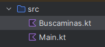

# BuscaminasConsolaKTenunciado
- Se trata de escribir un buscaminas en kotlin. Estate atento a cumplir los requisitos pedidos.
- Es uno de los juegos más famosos de la historia de los videojuegos. Si no sabes jugar al buscaminas busca cualquier página web que te permita jugar y que te explique las normas del juego
- Nombre de proyecto: BuscaMinas
  
  
  
- Separar la lógica de presentación de la lógica de negocio(dos capas). Ten encuenta que el código de Buscaminas.kt lo reutilizarás para hacer una versión gráfica de Buscaminas.
- Main.kt contendrá main() y todas las funciones que consideres necesarias para la interacción con el usuario.
- Main.kt no puede manipular directamente la modificación del tablero
- Main.kt puede:
    - ordenar destapar una celda. , podra utilizar una función publica de la clase Buscaminas destapar(fila,columna) o similar pero no puede modificar directamente el tablero de juego
    - leer el tablero, por ejemplo para imprimir, pero no puede modificarlo salvo a través de destapar()
    - consultar información de sólo lectura como por ejemplo saber el estado del juego (finalizado o no, etc.)
- Por lo tanto, de lo anterior se desprende que las clase/clases de Buscaminas.kt **deben de cumplir el principio de ocultación** de forma que que desde Main.kt sólo se puede modificar la información a través de las funciones públicas que ofrezcan las clases de Buscaminas.kt
- Buscaminas.kt al menos debe de contener una clase que se llame Buscaminas y otras clases y/o funciones si lo consideras oportuno.
- La clase Buscaminas se encarga de crear y gestionar el tablero de juego
- En esta versión de buscaminas se debe permitir colocar banderas (flags). 
- El tablero de juego se puede implementar de muchas formas
  - Una matriz de enteros donde cada entero es un código que representa el estado de la celda
  - tres matrices paralelas para almacenar respectivamente valor, tapada/destapada, bandera/no bandera
  - Una única matriz donde cada celda es un objeto de clase Celda o similar que guarda la información de estado de una celda. Intenta usar ésta, es la más estructurada.
  - otros  
- Las dimensiones del tablero y la cantidad de minas debe ser configurable.
- La clase Buscaminas debe enviar excepción:
  -   Si el número de filas y/o columnas es <1 
  -   Si el número de minas es igual o mayor que el número de celdas del tablero debe enviar excepción
    
## Para verificar que tu práctica está correcta:
- hay separación de lógica de juego y lógica de presentación
- BuscaMinas oculta el tablero. Desde main solo se puede modificar el tablero con la función pública de destapar
- Se lanzan las excepciones indicadas
